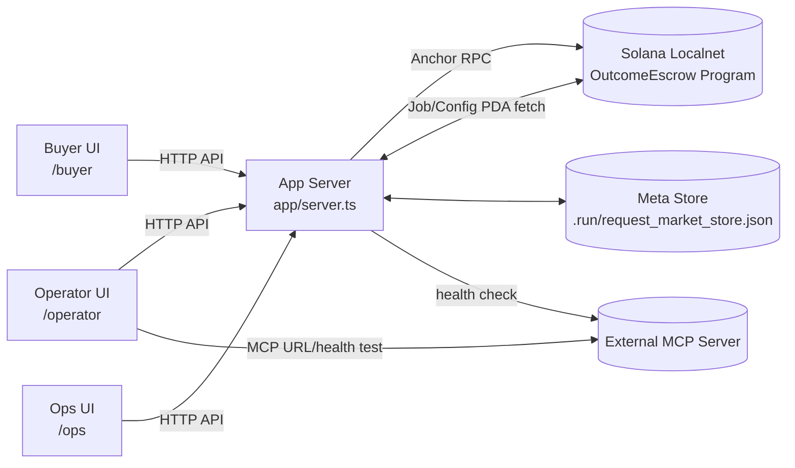

# OutcomeEscrow for MCP Workflows (Anchor MVP)

MCP 기반 작업을 pay-per-call이 아니라 **결과물(outcome)** 기준으로 정산하는 Solana Anchor MVP입니다. 정산 자산은 로컬에서 발행하는 **USDC 모사 SPL 토큰(6 decimals)** 입니다.

- Buyer: MCP 상품 선택 → 의뢰 생성/펀딩 → 결과 확인 → 승인/거절
- Operator: MCP 연결/상품 등록 → 결과 제출
- Ops: 분쟁 목록 확인 → approve/reject/timeout 처리

## Reference Architecture

```text
outcome_escrow_architecture.md
```

## 1) High-Level Architecture



### On-chain responsibility
- Escrow 상태 머신/정산 강제
- `create -> fund -> submit -> review/timeout -> settled/disputed -> resolve`

### Off-chain responsibility
- 상품 카탈로그/요청 상태 관리
- MCP 연결/헬스체크
- UI 워크플로

## 2) State & Pricing Model

### Job state (on-chain)
- `0 Created`
- `1 Funded`
- `2 Submitted`
- `3 Disputed`
- `4 Settled`

### Pricing (현재 구현)
- Buyer가 가격을 직접 입력하지 않음
- 가격 소스:
  - 우선: 카탈로그 `agentPriceLamports`
  - fallback: `mcpConnection.priceLamports`
- 단위: `USDC base units` (`1 USDC = 1_000_000`)

## 3) Role Pages

- `/buyer`
  - 상품 선택
  - 의뢰 생성/펀딩
  - 제출 결과 확인 + 승인/거절
- `/operator`
  - MCP 연결 테스트
  - 상품 등록/수정
  - 결과 제출
- `/ops`
  - 분쟁 목록 조회(open/all)
  - approve/reject/timeout 처리

## 4) Main API Surface

- Catalog / MCP
  - `GET /api/operator/catalog`
  - `POST /api/operator/catalog`
  - `GET /api/operator/mcp`
  - `POST /api/operator/mcp`
  - `POST /api/operator/mcp/test`

- Spec / Requests
  - `POST /api/jobs/spec`
  - `GET /api/jobs/spec/:jobId`
  - `GET /api/operator/requests`
  - `POST /api/operator/requests/decision`

- Transaction / Job
  - `POST /api/tx/create` (Phantom sign flow)
  - `POST /api/tx/fund`
  - `POST /api/tx/review`
  - `POST /api/tx/timeout`
  - `POST /api/tx/send`
  - `POST /api/jobs/submit`
  - `POST /api/jobs/resolve`
  - `POST /api/jobs/timeout`
  - `GET /api/jobs/:jobId`
  - `POST /api/token/faucet`

## 5) Local Run (bash 필요)

### Prerequisites
- Solana CLI (Agave) 3.x
- Anchor CLI 0.32.x
- Rust stable
- Node.js + npm

### Quick start
```bash
npm install
npm run stack:up
```

## 6) Docker Run (권장)

```bash
docker compose up -d validator
docker compose run --rm deployer
docker compose up -d --build app
```

### URLs
- Home: `http://127.0.0.1:8787`
- Buyer: `http://127.0.0.1:8787/buyer`
- Operator: `http://127.0.0.1:8787/operator`
- Ops: `http://127.0.0.1:8787/ops`

### Utilities
```bash
docker compose logs -f app
docker compose down
```

## 7) Bootstrap

초기화가 필요한 경우:
- **validator가 reset**된 경우 (컨테이너 재시작/볼륨 삭제)

```bash
POST /api/bootstrap
```

## 8) Faucet (임시 기능)

- API: `POST /api/token/faucet`
- Ops UI에서 사용 가능
- 환경변수로 비활성화 가능
  - `FAUCET_ENABLED=false` (API 차단)
  - `VITE_ENABLE_FAUCET=false` (UI 숨김, build 시 반영)

## 9) Persistent Admin Key (중요)

Docker에서 admin 키가 재생성되면 mint authority가 꼬일 수 있으므로
`docker-compose.yml`에 **admin 키 볼륨(app-keys)**를 유지합니다.

## 10) Notes

- Buyer는 **Submitted 상태**에서 결과 확인 후 승인/거절 가능
- 현재 결과 다운로드는 **제출 텍스트** 기반이며, 파일 업로드는 추후 확장
