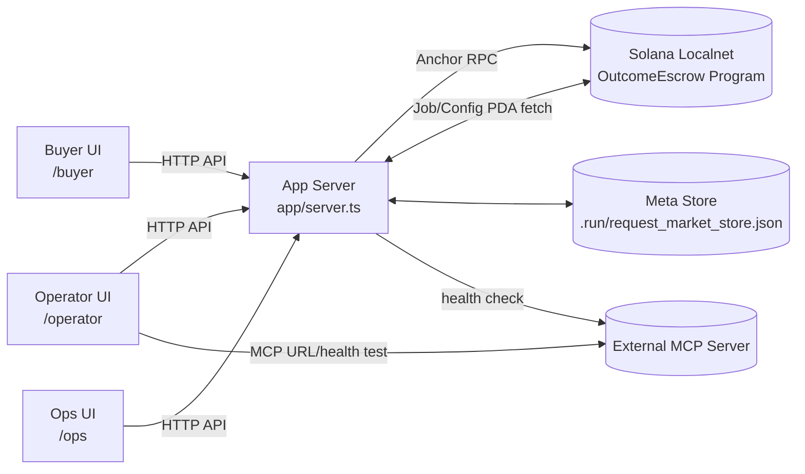
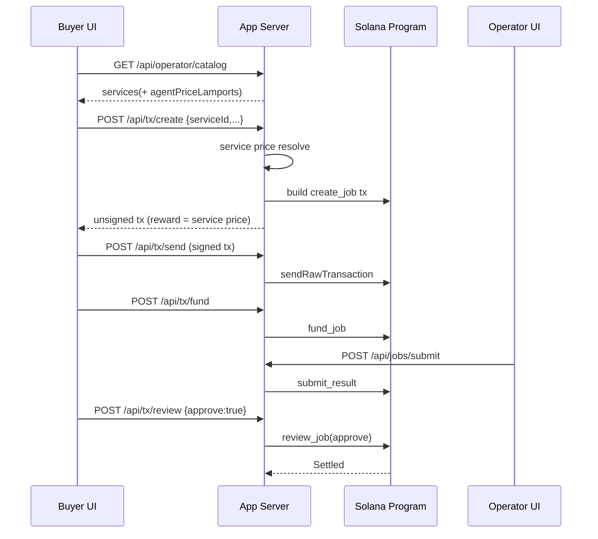
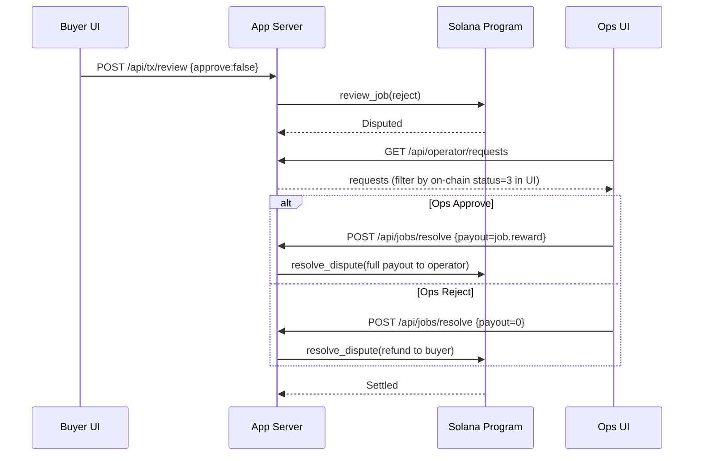

# OutcomeEscrow for MCP Workflows (Anchor MVP)

MCP 기반 에이전트 작업을 `호출 수(pay-per-call)`가 아니라 `결과(outcome)` 기준으로 정산하는 Solana Anchor MVP입니다.
결제 자산은 로컬에서 발행한 `USDC 모사 SPL 토큰(6 decimals)`을 사용합니다.

- Buyer: MCP 상품 선택 + 성공 기준 등록 + 에스크로 생성/펀딩 + 승인/거절
- Operator: MCP 연결 관리 + 상품 등록/수정(상품별 agent 가격) + 결과 제출
- Ops: 분쟁 리스트 확인 + approve/reject(최종 정산) + 수동 resolve/timeout

## Reference Architecture

- 설계 참고 문서: <https://github.com/c4stleone/SOLHeaven/blob/main/outcome_escrow_architecture.md>

## 1) Why this architecture

핵심 목표는 두 가지입니다.

1. 결과물 기준 정산
- 단순 API 호출 과금이 아니라, 작업 완료 상태와 최종 판정에 따라 지급/환불

2. 분쟁 가능한 B2B 흐름
- 실패/지연/품질 이슈 발생 시 `Disputed -> Ops resolve`로 안전한 종료

## 2) High-Level Architecture



### On-chain responsibility
- Escrow 상태 머신 및 정산 강제
- `create -> fund -> submit -> review/timeout -> settled/disputed -> resolve`

### Off-chain responsibility
- 상품 카탈로그/요청 스펙 관리
- MCP 연결/헬스체크
- 역할별 UI 워크플로우

## 3) State & Pricing Model

### Job state (on-chain)
- `0 Created`
- `1 Funded`
- `2 Submitted`
- `3 Disputed`
- `4 Settled`

### Pricing (현재 구현)
- Buyer가 가격을 임의 입력하지 않음
- 가격 소스:
  - 우선: 선택한 카탈로그 서비스의 `agentPriceLamports`
  - fallback: 운영자 기본 가격(`mcpConnection.priceLamports`)
- 단위: `USDC base units` (`1 USDC = 1_000_000`)
- 서버가 `create` 시점에 가격을 최종 강제

## 4) Sequence Diagram - Happy Path



## 5) Sequence Diagram - Dispute Path



## 6) Role Pages

- `/buyer`
  - 상품 선택
  - 성공 기준(spec) 등록
  - create/fund/review/timeout

- `/operator`
  - MCP 서버 연결/테스트
  - 카탈로그 등록/수정
  - 상품별 agent 가격 설정
  - 결과 제출

- `/ops`
  - 분쟁 목록 조회(open/all)
  - 분쟁 상세 확인
  - approve/reject 버튼으로 resolve 실행
  - fallback: 수동 resolve/timeout/query

## 7) Main API Surface

- Catalog / MCP
  - `GET /api/operator/catalog`
  - `POST /api/operator/catalog`
  - `GET /api/operator/mcp`
  - `POST /api/operator/mcp`
  - `POST /api/operator/mcp/test`

- Spec / Requests
  - `POST /api/jobs/spec`
  - `GET /api/jobs/spec/:jobId`
  - `GET /api/operator/requests`
  - `POST /api/operator/requests/decision`

- Transaction / Job
  - `POST /api/tx/create` (Phantom sign flow)
  - `POST /api/tx/fund`
  - `POST /api/tx/review`
  - `POST /api/tx/timeout`
  - `POST /api/tx/send`
  - `POST /api/jobs/submit`
  - `POST /api/jobs/resolve`
  - `POST /api/jobs/timeout`
  - `GET /api/jobs/:jobId`
  - `POST /api/token/faucet` (로컬 데모용 토큰 지급)

## 8) Repository Structure

```text
outcome-escrow-anchor/
├─ programs/outcome-escrow-anchor/src/lib.rs   # Anchor program
├─ sdk/src/                                    # TS SDK
├─ app/server.ts                               # API + static server
├─ frontend/src/                               # React role pages
├─ scripts/                                    # stack up/down/log helpers
├─ tests/                                      # mocha integration tests
├─ Anchor.toml / Cargo.toml / package.json
└─ README.md
```

## 9) Local Run

### Prerequisites
- Solana CLI (Agave) 3.x
- Anchor CLI 0.32.x
- Rust stable
- Node.js + npm

### Quick start
```bash
npm install
npm run stack:up
```

첫 실행 후 `Bootstrap`을 실행하면 아래가 자동으로 준비됩니다.
- Config PDA 초기화(ops/treasury/stable mint)
- 로컬 USDC 모사 mint 생성
- 역할 지갑의 ATA 생성
- Buyer 지갑으로 데모 토큰 민팅

### URLs
- Home: `http://127.0.0.1:8787`
- Buyer: `http://127.0.0.1:8787/buyer`
- Operator: `http://127.0.0.1:8787/operator`
- Ops: `http://127.0.0.1:8787/ops`

### Utilities
```bash
npm run stack:status
npm run stack:logs
npm run stack:down
bash scripts/verify_api.sh
```

### Ports
- App Server + Frontend (same process): `http://127.0.0.1:8787`
- Solana RPC (local validator): `http://127.0.0.1:8899`
- 즉, API 기본 포트는 `8787` 입니다. (`/api/*`)

### Restart + Full API Verification
```bash
npm run stack:down
npm run stack:up
bash scripts/verify_api.sh
```

`verify_api.sh`는 Buyer/Operator/Ops 주요 플로우를 포함해 50+ API assertion을 수행합니다.
- bootstrap / wallets / config / catalog / mcp
- create/fund/submit/review/resolve/timeout (custodial)
- tx create/fund/review/timeout + send (wallet sign flow)
- events / faucet / airdrop / operator request decision

참고: timeout은 프로그램 상태 머신상 `Submitted` 이후 + deadline 경과에서만 가능합니다.

## 10) Docker Run

Docker 구성은 `validator + deployer + app` 3개 서비스입니다.

- `validator`: Solana test-validator
- `deployer`: `target/deploy/outcome_escrow_anchor.so`를 validator에 배포
- `app`: `app/server.ts` 실행 (UI 정적 파일 포함)

### One-command up/down
```bash
./scripts/docker_stack_up.sh
./scripts/docker_stack_down.sh
```

### Manual compose
```bash
docker compose up -d validator
docker compose run --rm deployer
docker compose up -d app
```

### Endpoints
- Frontend: `http://127.0.0.1:8787`
- Backend health: `http://127.0.0.1:8787/api/health`
- RPC: `http://127.0.0.1:8899`

### Important
- `deployer`는 `target/deploy/outcome_escrow_anchor.so`와
  `target/deploy/outcome_escrow_anchor-keypair.json`을 사용합니다.
- 프로그램을 다시 빌드했다면 최신 `.so`를 커밋하거나 배포 단계를 다시 실행하세요.

## 11) Notes for team

- 현재는 Phase 0(중앙화 Ops 판정) 모델입니다.
- 자동 oracle 검증 레이어/x402 결합은 추후 확장 포인트로 분리했습니다.
- 데모 시 가장 중요한 포인트는 아래 3개입니다.
  1. 상품별 가격이 서버에서 강제되는지
  2. approve/reject에 따라 정산 경로가 달라지는지
  3. Disputed 상태에서 Ops 최종 판정으로 종료되는지

## 12) Stability Notes

- SDK 기본 commit level을 `processed` -> `confirmed`로 조정해,
  `create` 직후 `fund` 요청에서 발생하던 간헐적 race를 제거했습니다.
- `/api/bootstrap`는 on-chain config의 stable mint를 우선 source of truth로 사용해
  stable mint mismatch 상황을 완화했습니다.
