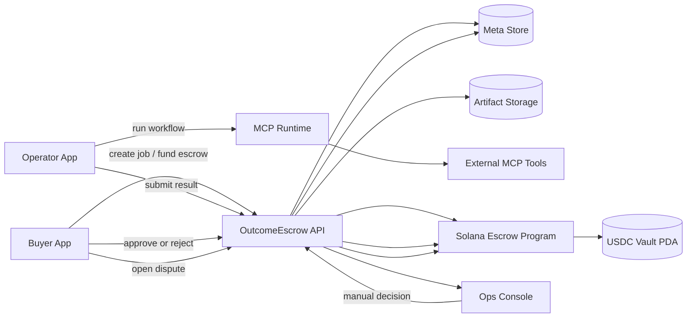
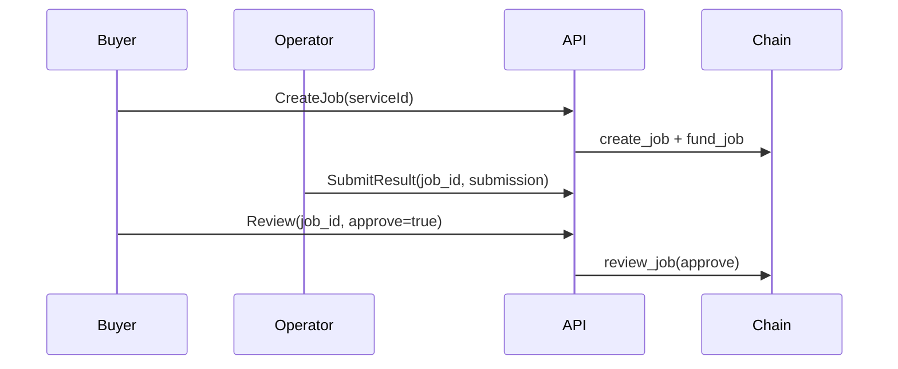
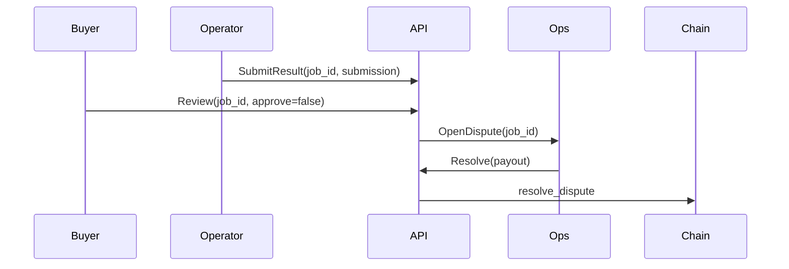

# OutcomeEscrow Architecture

## 1. Phase 0 MVP (검증기 포함 로컬 실행)

핵심:
- 승인/거절 권한: Buyer
- 분쟁 최종 결정: Ops
- 결과물 저장: 현재 텍스트 기반(추후 파일 업로드 확장 예정)

## 2. 플로우

### 2.1 정상 정산

### 2.2 분쟁 처리

## 3. 데이터 모델 (MVP 최소)

- Job
  - `job_id`, `buyer`, `operator`, `reward`, `deadline`, `status`
- Submission
  - `job_id`, `submission_text` (추후 파일/URI 확장)
- Review
  - `job_id`, `buyer_decision`, `decided_at`
- Dispute
  - `job_id`, `ops_decision`, `payout`

## 4. 확장 포인트

- MCP가 직접 결과물을 업로드하는 흐름
- 제출물 파일 저장(S3/MinIO/로컬) + 다운로드 링크
- 다자간 분쟁 판정/중재
