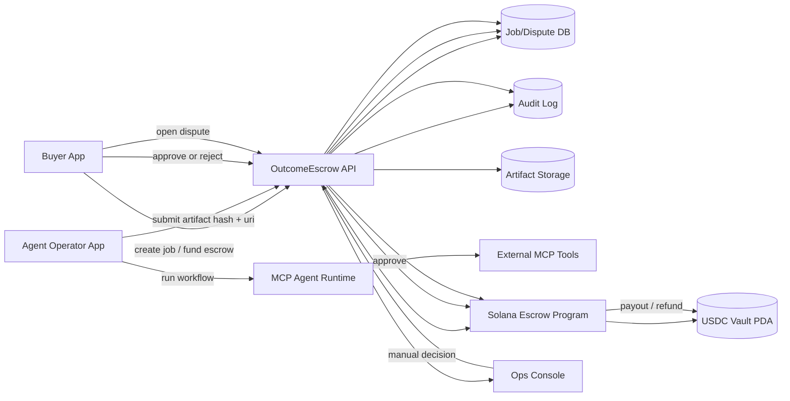
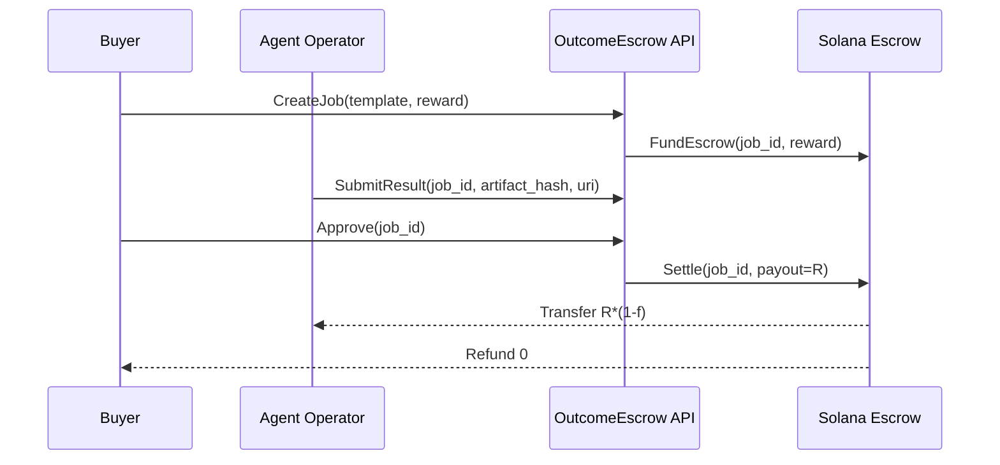
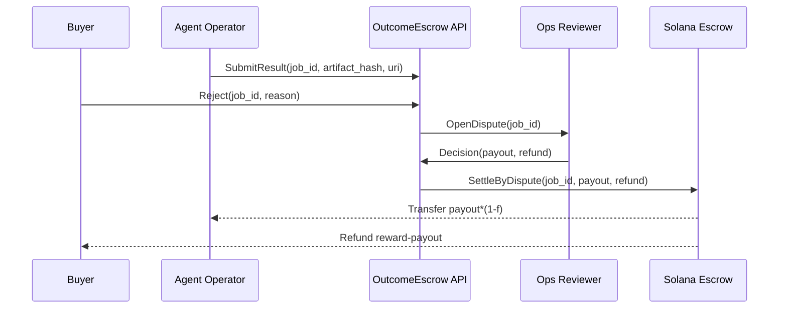

# OutcomeEscrow Architecture

## 1. Phase 0 MVP 아키텍처 (검증기 없음)

핵심:
- `판정 자동화 없음`: 승인 권한은 Buyer, 분쟁 판정은 운영자
- `온체인 최소화`: 자금 보관/정산만 체인, 업무 증빙은 오프체인
- `감사 가능성`: 모든 이벤트는 `Audit Log`에 append-only 기록

## 2. 핵심 시퀀스

### 2.1 성공 정산 플로우

### 2.2 분쟁 플로우

## 3. 컴포넌트 책임

- `Buyer App`
발주 등록, 예치, 승인/거절, 분쟁 생성
- `Agent Operator App`
MCP 실행, 결과물 제출, 분쟁 소명
- `OutcomeEscrow API`
업무 상태 관리, 승인/분쟁 워크플로우, 체인 트랜잭션 오케스트레이션
- `Solana Escrow Program`
예치/정산/환불 집행, 자금 무결성 보장
- `Ops Console`
분쟁 검토와 최종 지급 비율 결정
- `Artifact Storage + Audit Log`
증빙 보관, 사후 검증 및 컴플라이언스 대응

## 4. 데이터 모델 (MVP 최소)

- `Job`
`job_id`, `buyer`, `operator`, `reward`, `deadline`, `status`
- `Submission`
`job_id`, `artifact_hash`, `artifact_uri`, `submitted_at`
- `Review`
`job_id`, `buyer_decision`, `reason`, `decided_at`
- `Dispute`
`job_id`, `opened_by`, `ops_decision`, `payout`, `closed_at`

## 5. 신뢰 경계

- On-chain 신뢰:
자금 보관과 분배 결과
- Off-chain 신뢰:
결과물 저장, 분쟁 판정, 운영자 의사결정
- MVP 리스크:
운영자 판정 중앙화
- 완화책:
판정 로그 공개, SLA 고정, Phase 1에서 다중 검증자 도입

## 6. Phase 확장 포인트

- `Phase 1`
룰 기반 경량 검증기 도입(스키마/테스트/기한 체크)
- `Phase 2`
허가형 전문가 패널(2-of-3) 분쟁 판정
- `Phase 3`
공개 검증자 네트워크(스테이킹/슬래시)
